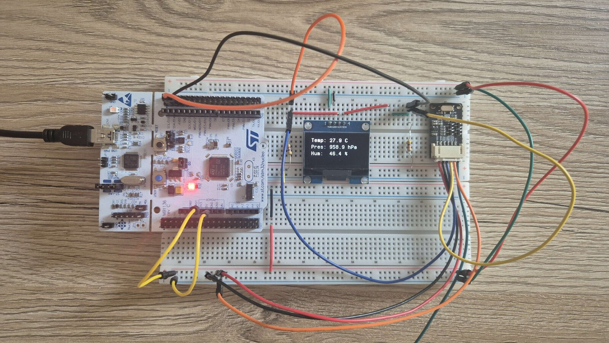
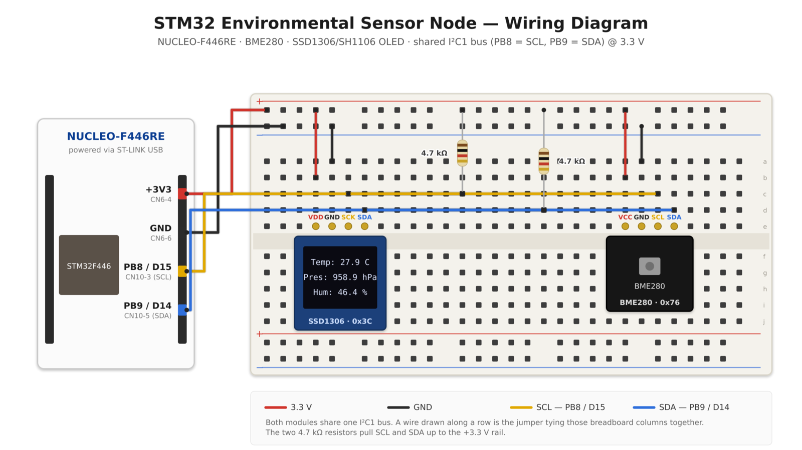

# STM32 Environmental Sensor Node (BME280 + OLED)

[](https://en.wikipedia.org/wiki/C_(programming_language))
[](https://www.st.com/en/microcontrollers-microprocessors/stm32f446re.html)
[](https://www.st.com/en/embedded-software/stm32cubef4.html)
[](https://cmake.org/)

An embedded environmental monitoring system built on the STM32F4 platform. This project reads temperature, pressure, and humidity data from a **BME280** sensor and visualizes it in real-time on an **SSD1306/SH1106 OLED display**. It features a custom lightweight sensor driver, robust I2C error handling, and a modular CMake build architecture.

---

## Project Showcase



<sub>Live readings on the OLED: temperature, barometric pressure and relative humidity.</sub>

---

## Key Features

* **Custom BME280 Driver:** A lightweight, custom-written C driver avoiding third-party libraries. Reads raw ADC values and performs 32-bit/64-bit compensation calculations.
* **OLED Visualization:** Uses an SSD1306 compatible library (adapted for SH1106 memory mapping) with an animated boot sequence and clean UI.
* **Robust Error Handling (Self-Healing):** Implements hot-plug detection. If the sensor or I2C connection is temporarily lost, the system logs an error via UART, gracefully waits, and automatically reinitializes once the connection is restored without requiring a hard reset.

---

## Hardware Requirements

* **Microcontroller:** STM32 Nucleo-64 (STM32F446RE used in this build)
* **Sensor:** BME280 (Temperature, Humidity, Pressure) via I2C
* **Display:** 1.3" or 0.96" OLED Display (SSD1306 or SH1106 controller) via I2C
* **Pull-ups:** 2 × 4.7 kΩ resistors (I2C bus pull-ups to 3V3)
* **Misc:** Breadboard, Jumper Wires

### Wiring Diagram



<sub>Vector source: [`docs/images/wiring_diagram.svg`](docs/images/wiring_diagram.svg)</sub>

Everything hangs on a single I2C bus: both modules are supplied with 3.3 V from the
Nucleo and share `PB8` (SCL) and `PB9` (SDA). The bus is pulled up to 3V3 by two
4.7 kΩ resistors on the breadboard.

### Pinout Configuration

| Component | Pin Function | STM32 Pin | Nucleo Header | Note |
| --- | --- | --- | --- | --- |
| **BME280** | VCC | 3V3 | CN6-4 (`+3V3`) | Module runs at 3.3 V |
| **BME280** | GND | GND | CN6-6 (`GND`) |  |
| **BME280** | SCL | PB8 (I2C1_SCL) | CN10-3 / Arduino `D15` | Shared I2C bus |
| **BME280** | SDA | PB9 (I2C1_SDA) | CN10-5 / Arduino `D14` | Shared I2C bus |
| **BME280** | ADDR | — | — | Left at default → address `0x76` |
| **OLED** | VDD | 3V3 | CN6-4 (`+3V3`) |  |
| **OLED** | GND | GND | CN6-6 (`GND`) |  |
| **OLED** | SCK (SCL) | PB8 (I2C1_SCL) | CN10-3 / Arduino `D15` | Shared I2C bus |
| **OLED** | SDA | PB9 (I2C1_SDA) | CN10-5 / Arduino `D14` | Shared I2C bus |
| **Pull-up 1** | SCL → 3V3 | — | — | 4.7 kΩ |
| **Pull-up 2** | SDA → 3V3 | — | — | 4.7 kΩ |

**I2C addresses:** BME280 `0x76` (7-bit), OLED `0x3C` (7-bit) — see
`Core/Inc/bme280_driver.h` and `Drivers/stm32-ssd1306/Inc/ssd1306_conf.h`.
PB8/PB9 are the same physical pins on the Morpho header (CN10) and on the
Arduino header (`D15`/`D14`), so either one can be used.

---

## Installation and Build

### Prerequisites

* [Visual Studio Code](https://code.visualstudio.com/)
* [STM32 VS Code Extension](https://marketplace.visualstudio.com/items?itemName=stmicroelectronics.stm32-vscode-extension)
* ARM GNU Toolchain (`arm-none-eabi-gcc`)
* CMake build system

### Steps

1. **Clone the repository**

2. **Configure with CMake:**
Open the folder in VS Code. The STM32 extension or CMake Tools should automatically detect the `CMakeLists.txt`. Run the configuration step (or run `cmake -B build -G Ninja`).

3. **Build the Project:**
Click the "Build" button in the VS Code status bar (or run `cmake --build build`).

4. **Flash to Target:**
Connect your Nucleo board via USB. Use the VS Code STM32 Extension to "Flash" the device, or use STM32CubeProgrammer directly with the generated `.elf` or `.bin` file.

---

## Usage & Serial Output

1. Power the board.
2. The OLED will show an animated `Booting...` screen.
3. Open a Serial Monitor (e.g., PuTTY, TeraTerm, or VS Code Serial Monitor) and connect to the ST-Link Virtual COM port.

* **Baud Rate:** `115200`
* **Data Bits:** `8`
* **Parity:** `None`
* **Stop Bits:** `1`

**Example Serial Output:**

```text
Started BME280 Driver!
Temp: 24.50 C | Pressure: 1012.30 hPa | Humidity: 45.20 %
Temp: 24.52 C | Pressure: 1012.31 hPa | Humidity: 45.25 %
WARNING: Lost connection to the BME280 sensor!
-> Sensor reconnected and initialized!
Temp: 24.51 C | Pressure: 1012.30 hPa | Humidity: 45.22 %
```

---

## Project Structure

```text
├── cmake/stm32cubemx/           # Auto-generated HAL and startup code (untouched)
├── Core/
│   ├── Inc/                     # Main application headers (main.h)
│   └── Src/                     # Main application logic (main.c)
├── Drivers/
└──   └── stm32-ssd1306/         # OLED driver library
```

---

## License

This project is licensed under the MIT License - see the [LICENSE](LICENSE) file for details.

---

**Developed by Luis Kahles**

*Focus: Embedded C Development, Hardware Interfacing & Robust I2C Drivers.*
